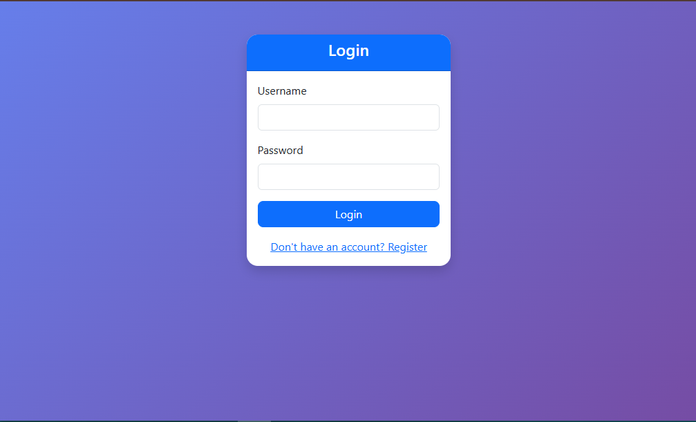
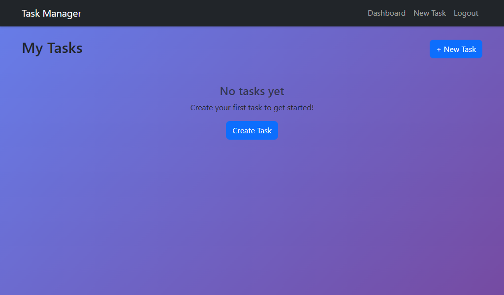

# Task Management System

A web-based Task Management System built with **Python Flask**, **SQLite**, and **Bootstrap 5**. Features user authentication, full task CRUD operations, and a responsive dashboard.

---

## Screenshots

| Login Page | Register Page |
|---|---|
|  |  |

| Dashboard | Create Task |
|---|---|
|  |  |

---

## Features

- User Registration & Login with password hashing
- Session-based authentication (Flask-Login)
- Create, Read, Update, Delete tasks
- Mark tasks as Complete / Pending (toggle)
- Task ownership enforcement (users only see their own tasks)
- Responsive Bootstrap 5 UI with gradient styling
- Server-side input validation
- Flash messages for user feedback
- SQLite database (no external DB setup needed)
- 16 PyTest unit tests (auth + CRUD)

---

## Tech Stack

| Layer | Technology |
|-------|-----------|
| Backend | Python 3 + Flask |
| Database | SQLite (via SQLAlchemy ORM) |
| Frontend | HTML5, CSS3, Bootstrap 5 |
| Auth | Flask-Login + Werkzeug hashing |
| Testing | PyTest |
| Version Control | Git & GitHub |

---

## Installation

```bash
# 1. Clone the repository
git clone https://github.com/AbdulAhadSerfraz/task-management-system.git
cd task-management-system

# 2. Install dependencies
pip install -r requirements.txt

# 3. Run the application
python app.py

# 4. Open in browser
# http://127.0.0.1:5000
```

---

## Running Tests

```bash
pytest tests/ -v
```

Expected output: **16 passed**

---

## Project Structure

```
task-management-system/
├── app.py               # Flask application factory
├── config.py            # Configuration settings
├── extensions.py        # Flask extensions (db, login_manager)
├── requirements.txt     # Python dependencies
├── .gitignore
├── README.md
├── screenshots/         # Application screenshots
│   ├── login.png
│   ├── register page.png
│   ├── dashboard.png
│   └── new task.png
├── models/
│   ├── __init__.py
│   ├── user.py          # User model (auth)
│   └── task.py          # Task model (CRUD)
├── routes/
│   ├── __init__.py
│   ├── auth_routes.py   # Login/Register/Logout
│   └── task_routes.py   # Task CRUD operations
├── templates/
│   ├── base.html        # Base layout (Bootstrap)
│   ├── login.html       # Login form
│   ├── register.html    # Registration form
│   ├── dashboard.html   # Task dashboard
│   ├── create_task.html # Create task form
│   └── edit_task.html   # Edit task form
├── static/
│   └── css/
│       └── style.css    # Custom styles
├── tests/
│   ├── __init__.py
│   └── test_app.py      # 16 PyTest tests
└── utils/
    └── __init__.py
```

---

## Application Workflow

```
User opens browser → http://localhost:5000
         │
         ▼
    ┌─────────────┐
    │  Home Page   │  Redirects to Login or Dashboard
    └──────┬──────┘
           │
    ┌──────▼──────┐
    │   Register  │  Create account (username, email, password)
    └──────┬──────┘
           ▼
    ┌─────────────┐
    │    Login    │  Authenticate → session created
    └──────┬──────┘
           ▼
    ┌─────────────┐      ┌──────────────────┐
    │  Dashboard  │──────│   Create Task    │
    │ (Task List) │      └──────────────────┘
    └──────┬──────┘
           │
    ┌──────▼──────┐      ┌──────────────────┐
    │  Task Card  │──────│   Edit Task      │
    │ (Actions)   │──────│   Delete Task    │
    │             │──────│   Complete/Undo  │
    └─────────────┘
```

---

## API Routes

| Method | Route | Description | Auth |
|--------|-------|-------------|------|
| GET | `/` | Home redirect | No |
| GET/POST | `/login` | Login page/form | No |
| GET/POST | `/register` | Registration page/form | No |
| GET | `/logout` | Logout user | Yes |
| GET | `/dashboard` | View tasks | Yes |
| GET/POST | `/tasks/create` | Create task | Yes |
| GET/POST | `/tasks/edit/<id>` | Edit task | Yes |
| GET | `/tasks/delete/<id>` | Delete task | Yes |
| GET | `/tasks/complete/<id>` | Toggle status | Yes |

---

## Team Members

| Member | Role | Branch |
|--------|------|--------|
| **Abdul Ahad** | Project Lead (Structure, Factory, Integration) | `master` / `develop` |
| **Abubakar** | Authentication Module (Login, Register, Session) | `feature-auth` |
| **Rehan** | Task CRUD Module (Create, Edit, Delete, Complete) | `feature-task-crud` |
| **Hassan Adeel** | UI + Testing + Documentation | `feature-ui-testing` |

---

## Git Workflow

1. All development happens on feature branches
2. Pull requests are created before merging into `develop`
3. `main` branch contains only stable, tested code
4. Commit messages follow conventional format
